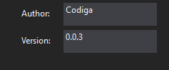
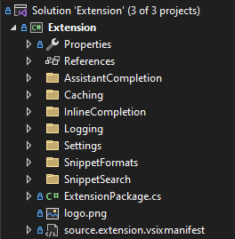

# Development documentation
This documentation provides a high level view on the technical components of the extension project.

# Table of contents
1. [General](#general) 
2. [Releasing](#releasing)
3. [Project structure](#project-structure)
4. [Feature overview](#feature-overview)
   1. [Shortcut snippets](#shortcut-snippets)
   2. [Inline completion](#inline-completion)
   3. [Snippet search](#snippet-search)
   4. [Settings](#settings)
5. [Frameworks/Packages](#frameworkspackages)
6. [Testing](#testing)
7. [Links/Help](#linkshelp)

# General
As Visual Studio has a long history, the SDK also has different APIs. The older one is referred to as [Legacy API](https://learn.microsoft.com/en-us/visualstudio/extensibility/internals/legacy-language-service-extensibility?view=vs-2022) and the current one uses the [MEF](https://learn.microsoft.com/en-us/visualstudio/extensibility/managed-extensibility-framework-in-the-editor?view=vs-2022) and async API. Not all APIs were migrated to the new style yet, so we have a mix of both in the extension. For example, the API for inserting snippets is a Legacy API.
## MEF
The Managed Extensibility Framework is working like a dependency injection framework for Visual Studio components. Registering implementations of a type or interface is done via the `[Export]` attribute and receiving already registered components and services is done via `[Import]`. Depending on the context most exported components are instantiated as singletons.

# Releasing


The build and release process is automated via GitHub Actions. The release workflow is defined in [release.yml](.github/workflows/release.yml). 
## Versioning


The version of the extension is stored in the manifest file `src/source.extension.vsixmanifest`. The vsix manifest editor in Visual Studio generates the C#-Class `src/source.extension.cs` that is used to version the assemblies. To update the Version of the Extension I recommend doing it in the VSIX-editor.
## Releasing a new version to the marketplace
To trigger a new release build follow these steps:
1. Update the manifest file with the new version number in Visual Studio
2. Draft a new release on GitHub with a new tag matching the version of the manifest file
3. Create the release. This will trigger the release pipeline that will take care of updating the marketplace.

>To further automate this process, we would need to update the manifest file AND the C#-File with the just generated version tag before the extension is compiled in the build step.


# Project structure
The project is divided into three projects:
* `Extension.csproj` - for the actual extension
* `GraphQLClient.csproj` - for handling the Codiga API
* `Tests.csproj` - for the unit tests

Visual Studio Extensions still need to target full .NET 4.8 Framework as Visual Studio itself is not migrated to .NET 6 or 7. That means for all libraries and packages we reference in our `Extension.csproj` we can only use [.NET Standard 2.0](https://learn.microsoft.com/en-us/dotnet/standard/net-standard?tabs=net-standard-2-0).

## Folder structure



* `AssistantCompletion` - support for shortcut completion
* `Caching` - everything related to Snippet caching
* `InlineCompletion` - support for inline snippet completion
* `Logging` - Helper classes for Rollbar logging
* `Settings` - Handling current VS setting including the Codiga    settings dialog
* `SnippetFormats` - The different snippet models and the parsing
* `SnippetSearch` - The menu entry and the tool window for the snippet search
* `ExtensionPackage.cs` - registrations for settings dialog and search window
* `.vsixmanifest` - metadata for the extension that will show up in the marketplace
  
<br>


# Feature overview

## Shortcut snippets
The shortcut snippets feature is triggered by typing `.` in the editor. This is the general workflow:

The key part here is that we prevent the normal code completion session from completing the keyword and start an Expansion session instead.
### Triggering
For the completion menu and triggering we use the standard API based on [this example](https://github.com/microsoft/VSSDK-Extensibility-Samples/tree/master/AsyncCompletion).

### Inserting
Snippet insertion sessions are called [*Expansion*](https://learn.microsoft.com/en-us/visualstudio/extensibility/walkthrough-implementing-code-snippets?view=vs-2022&tabs=csharp) on the Visual Studio API. The insertion process is the same for all three features and is done in `AssistantCompletion/ExpansionManager.cs`. We bypass the regular `.snippet` files by calling:
```csharp
public int IVsExpansion.InsertSpecificExpansion (
    MSXML.IXMLDOMNode pSnippet, 
    Microsoft.VisualStudio.TextManager.Interop.TextSpan tsInsertPos,
    Microsoft.VisualStudio.TextManager.Interop.IVsExpansionClient pExpansionClient, 
    Guid guidLang, 
    string pszRelativePath, 
    out Microsoft.VisualStudio.TextManager.Interop.IVsExpansionSession pSession);
```     
 See the [documentation](https://learn.microsoft.com/en-us/dotnet/api/microsoft.visualstudio.textmanager.interop.ivsexpansion.insertspecificexpansion?view=visualstudiosdk-2022).

 This API allows us to insert snippets from in-memory XML using the [Visual Studio snippet XML schema](https://learn.microsoft.com/en-us/visualstudio/ide/code-snippets-schema-reference?view=vs-2022).
 We just need to serialize the incoming Codiga Recipes into the required XML format:
 
 
During the expansion session, we use [`IOleCommandTarget`](https://learn.microsoft.com/en-us/dotnet/api/microsoft.visualstudio.ole.interop.iolecommandtarget?view=visualstudiosdk-2022) to handle incoming keystrokes and commands to pass `Tab` keys to the expansion and enable navigation between the user variables. The snippet usage reporting is also done in this module.

>For more details look at the answer on [this thread](https://learn.microsoft.com/en-us/answers/questions/1018899/visual-studio-extensibility-addinginstalling-snipp.html).


 ## Inline completion
The inline completion is triggered by starting a line comment on a new line.
### Triggering
To be able to trigger the inline completion we make use of another `IOleCommandTarget` in `InlineCompletion/InlineCompletionClient.cs`. Where we check if a session should be started based on the typed text of the current line.
### Preview
The preview is done by drawing on the editor Canvas by using [TextAdornments](https://learn.microsoft.com/de-de/archive/blogs/lucian/visual-studio-text-adornment-vsix-using-roslyn) which allows adding WPF controls in relation to editor text lines. The drawing of the instructions and the preview is done in `InlineCompletionView.cs`.
> An approach inserting styled code directly to the editor was dismissed as scrolling through suggestions would add all of those to the undo/redo stack which resulted in a bad UX.

### Inserting
Inserting is handled the same way as with the shortcut snippets using `ExpansionClient.StartExpansion()`.

## Snippet search
The snippet search is implemented using a [ToolWindow](https://learn.microsoft.com/en-us/visualstudio/extensibility/adding-a-tool-window?view=vs-2022). Tool windows are written using WPF and the search window UI is defined in `SnippetSearch/View/SnippetSearchControl.xaml`. We try to follow [MVVM](https://learn.microsoft.com/en-us/dotnet/architecture/maui/mvvm) as much as possible, therefore the UI is mostly driven by the Binding on `SnippetSearchViewModel.cs`. 

### Preview
The preview for snippets from the Snippet Search is done by inserting the code in the editor and using a [Classifier](https://learn.microsoft.com/en-us/visualstudio/extensibility/language-service-and-editor-extension-points?view=vs-2022#extend-classification-types-and-classification-formats) to style the span in a way that makes it obvious to users that this is a preview. The classifier is polling the text spans to be classified on changes to the editor. While the preview is active we provide a static span to be used. When the preview ends, it is set to `null`. The whole preview and classification logic is grouped under `SnippetSearch/Preview`.

### Inserting
When inserting the snippet the preview span is replaced by the new Expansion via the `ExpansionClient`.

### Menu item
To be able to bring up the tool window via the menu, two parts are needed:
1. Define the menu item command in a [VS command table](https://learn.microsoft.com/en-us/visualstudio/extensibility/internals/visual-studio-command-table-dot-vsct-files?view=vs-2022) (`SnippetSearchPackage.vsct`)
2. Implement the command that gets fired when clicking the menu item (done in `SearchWindowMenuCommand.cs`)

## Settings
The settings dialog is also divided into the settings model and the options dialog that shows up in the VS settings.
The definition and registration of the Codiga settings are done in `Settings/ExtensionOptions.cs`. These settings are stored in the Windows registry and can be accessed via a singleton instance `CodigaOptions.Instance`. The UI for the settings is defined in `OptionsPage.xaml`. For the simple settings dialog, the minimal logic is done in the [code-behind](https://learn.microsoft.com/en-us/dotnet/desktop/wpf/advanced/code-behind-and-xaml-in-wpf?view=netframeworkdesktop-4.8) file `OptionsPage.xaml.cs`.

# Frameworks/Packages
List of used third-party frameworks and packages:

| Library | Purpose|
|-|-|
| [NUnit](https://nunit.org/) | Unit test framework |
| [Moq](https://github.com/Moq) | For mocking in unit tests |
| [GraphQL .NET](https://github.com/graphql-dotnet/graphql-dotnet) | For consuming the Codiga API | 
| [Visual Studio Community Toolkit](https://github.com/VsixCommunity/Community.VisualStudio.Toolkit) | For easier development against the VS SDK |      

# Testing
Some general overview of features and edge cases beyond the defined extension main features that should be tested with Visual Studio:
| Scenario | Expected|
|-|-|
| Drag a file tab out of the main VS window and create a new one | All extension features should work in both windows |
| Changing the color theme under Tools -> Theme | The search window should adapt to the new theme. |
| Changing the font settings under Tools -> Options -> Environment -> Fonts and Colors | Should also affect the inline completion and snippet search preview. |

# Links/Help
Some helpful links:
* [Community examples](https://github.com/VsixCommunity/Samples)
* [Official example repo](https://github.com/microsoft/VSSDK-Extensibility-Samples)
* [VSIX Cookbook](https://www.vsixcookbook.com/)
* [Gitter community](https://gitter.im/Microsoft/extendvs)
* [Visual Studio YT channel with tutorials](https://www.youtube.com/playlist?list=PLReL099Y5nRdG2n1PrY_tbCsUznoYvqkS)


