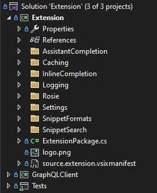
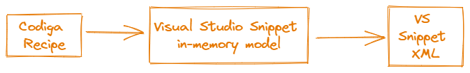

# Development documentation
This documentation provides a high level view on the technical components of the extension project.

# Table of contents
1. [General](#general) 
2. [Releasing](#releasing)
3. [Project structure](#project-structure)
4. [Feature overview](#feature-overview)
   1. [Shortcut snippets](#shortcut-snippets)
   2. [Inline completion](#inline-completion)
   3. [Snippet search](#snippet-search)
   4. [Settings](#settings)
5. [Frameworks/Packages](#frameworkspackages)
6. [Testing](#testing)
7. [Links/Help](#linkshelp)

# General
As Visual Studio has a long history, the SDK also has different APIs. The older one is referred to as [Legacy API](https://learn.microsoft.com/en-us/visualstudio/extensibility/internals/legacy-language-service-extensibility?view=vs-2022) and the current one uses the [MEF](https://learn.microsoft.com/en-us/visualstudio/extensibility/managed-extensibility-framework-in-the-editor?view=vs-2022) and async API. Not all APIs were migrated to the new style yet, so we have a mix of both in the extension. For example, the API for inserting snippets is a Legacy API.
## MEF
The Managed Extensibility Framework is working like a dependency injection framework for Visual Studio components. Registering implementations of a type or interface is done via the `[Export]` attribute and receiving already registered components and services is done via `[Import]`. Depending on the context most exported components are instantiated as singletons.

# Releasing


The build and release process is automated via GitHub Actions. The release workflow is defined in [release.yml](.github/workflows/release.yml). 
## Versioning


The version of the extension is stored in the manifest file [`src/source.extension.vsixmanifest`](src/Extension/source.extension.vsixmanifest). The vsix manifest editor in Visual Studio generates the C#-Class [`src/Extension/source.extension.cs`](src/Extension/source.extension.cs) that is used to version the assemblies. To update the Version of the Extension I recommend doing it in the VSIX-editor.
## Releasing a new version to the marketplace


To trigger a new release build follow these steps:
1. Update the manifest file with the new version number in Visual Studio
2. Draft a new release on GitHub with a new tag matching the version of the manifest file
3. Create the release. This will trigger the release pipeline that will take care of updating the marketplace.

>To further automate this process, we would need to update the manifest file AND the C#-File with the just generated version tag before the extension is compiled in the build step.


# Project structure
The project is divided into three projects:
* [`Extension.csproj`](src/Extension/Extension.csproj) - for the actual extension
* [`GraphQLClient.csproj`](src/GraphQLClient/GraphQLClient.csproj) - for handling the Codiga API
* [`Tests.csproj`](src/Tests/Tests.csproj) - for the unit tests

Visual Studio Extensions still need to target full .NET 4.8 Framework as Visual Studio itself is not migrated to .NET 6 or 7. That means for all libraries and packages we reference in our `Extension.csproj` we can only use [.NET Standard 2.0](https://learn.microsoft.com/en-us/dotnet/standard/net-standard?tabs=net-standard-2-0).

## Folder structure



* `AssistantCompletion` - support for shortcut completion
* `Caching` - everything related to Snippet caching
* `InlineCompletion` - support for inline snippet completion
* `Logging` - Helper classes for Rollbar logging
* `Rosie` - Static code analysis and its lightbulb actions
* `Settings` - Handling current VS setting including the Codiga settings dialog
* `SnippetFormats` - The different snippet models and the parsing
* `SnippetSearch` - The menu entry and the tool window for the snippet search
* `ExtensionPackage.cs` - registrations for settings dialog and search window
* `.vsixmanifest` - metadata for the extension that will show up in the marketplace
  
<br>


# Feature overview

## Shortcut snippets
The shortcut snippets feature is triggered by typing `.` in the editor. This is the general workflow:

The key part here is that we prevent the normal code completion session from completing the keyword and start an Expansion session instead.
### Triggering
For the completion menu and triggering we use the standard API based on [this example](https://github.com/microsoft/VSSDK-Extensibility-Samples/tree/master/AsyncCompletion).

### Inserting
Snippet insertion sessions are called [*Expansion*](https://learn.microsoft.com/en-us/visualstudio/extensibility/walkthrough-implementing-code-snippets?view=vs-2022&tabs=csharp) on the Visual Studio API. The insertion process is the same for all three features and is done in [`AssistantCompletion/ExpansionClient.cs`](src/Extension/AssistantCompletion/ExpansionClient.cs). We bypass the regular `.snippet` files by calling:
```csharp
public int IVsExpansion.InsertSpecificExpansion (
    MSXML.IXMLDOMNode pSnippet, 
    Microsoft.VisualStudio.TextManager.Interop.TextSpan tsInsertPos,
    Microsoft.VisualStudio.TextManager.Interop.IVsExpansionClient pExpansionClient, 
    Guid guidLang, 
    string pszRelativePath, 
    out Microsoft.VisualStudio.TextManager.Interop.IVsExpansionSession pSession);
```     
 See the [documentation](https://learn.microsoft.com/en-us/dotnet/api/microsoft.visualstudio.textmanager.interop.ivsexpansion.insertspecificexpansion?view=visualstudiosdk-2022).

 This API allows us to insert snippets from in-memory XML using the [Visual Studio snippet XML schema](https://learn.microsoft.com/en-us/visualstudio/ide/code-snippets-schema-reference?view=vs-2022).
 We just need to serialize the incoming Codiga Recipes into the required XML format:

 
 
During the expansion session, we use [`IOleCommandTarget`](https://learn.microsoft.com/en-us/dotnet/api/microsoft.visualstudio.ole.interop.iolecommandtarget?view=visualstudiosdk-2022) to handle incoming keystrokes and commands to pass `Tab` keys to the expansion and enable navigation between the user variables. The snippet usage reporting is also done in this module.

>For more details look at the answer on [this thread](https://learn.microsoft.com/en-us/answers/questions/1018899/visual-studio-extensibility-addinginstalling-snipp.html).

For a detailed explanation on the async completion API, there is a great GitHub issue at [microsoft/vs-editor-api#Async Completion API discussion](https://github.com/microsoft/vs-editor-api/issues/9).


## Inline completion
The inline completion is triggered by starting a line comment on a new line.
### Triggering
To be able to trigger the inline completion we make use of another `IOleCommandTarget` in [`InlineCompletion/InlineCompletionClient.cs`](src/Extension/InlineCompletion/InlineCompletionClient.cs). Where we check if a session should be started based on the typed text of the current line.
### Preview
The preview is done by drawing on the editor Canvas by using [TextAdornments](https://learn.microsoft.com/de-de/archive/blogs/lucian/visual-studio-text-adornment-vsix-using-roslyn) which allows adding WPF controls in relation to editor text lines. The drawing of the instructions and the preview is done in [`InlineCompletionView.cs`](src/Extension/InlineCompletion/InlineCompletionView.cs).
> An approach inserting styled code directly to the editor was dismissed as scrolling through suggestions would add all of those to the undo/redo stack which resulted in a bad UX.

### Inserting
Inserting is handled the same way as with the shortcut snippets using `ExpansionClient.StartExpansion()`.

## Snippet search
The snippet search is implemented using a [ToolWindow](https://learn.microsoft.com/en-us/visualstudio/extensibility/adding-a-tool-window?view=vs-2022). Tool windows are written using WPF and the search window UI is defined in [`SnippetSearch/View/SnippetSearchControl.xaml`](src/Extension/SnippetSearch/View/SnippetSearchControl.xaml). We try to follow [MVVM](https://learn.microsoft.com/en-us/dotnet/architecture/maui/mvvm) as much as possible, therefore the UI is mostly driven by the Binding on [`SnippetSearchViewModel.cs`](src/Extension/SnippetSearch/View/SnippetSearchViewModel.cs). 

### Preview
The preview for snippets from the Snippet Search is done by inserting the code in the editor and using a [Classifier](https://learn.microsoft.com/en-us/visualstudio/extensibility/language-service-and-editor-extension-points?view=vs-2022#extend-classification-types-and-classification-formats) to style the span in a way that makes it obvious to users that this is a preview. The classifier is polling the text spans to be classified on changes to the editor. While the preview is active we provide a static span to be used. When the preview ends, it is set to `null`. The whole preview and classification logic is grouped under [`SnippetSearch/Preview`](/src/Extension/SnippetSearch/Preview/).

### Inserting
When inserting the snippet the preview span is replaced by the new Expansion via the [`ExpansionClient`](src/Extension/AssistantCompletion/ExpansionClient.cs).

### Menu item
To be able to bring up the tool window via the menu, two parts are needed:
1. Define the menu item command in a [VS command table](https://learn.microsoft.com/en-us/visualstudio/extensibility/internals/visual-studio-command-table-dot-vsct-files?view=vs-2022) ([`SnippetSearchPackage.vsct`](src/Extension/SnippetSearch/SnippetSearchPackage.vsct))
2. Implement the command that gets fired when clicking the menu item (done in [`SearchWindowMenuCommand.cs`](/src/Extension/SnippetSearch/SearchWindowMenuCommand.cs))

## Rosie code analysis

Rosie is the static code analysis tool and service of Codiga. Its implementation requirements are available
at [Implementing an IDE plugin for analyzing custom rules](https://doc.codiga.io/docs/rosie/ide-specification/).

### Rules cache

In order to perform code analysis, users must have a `codiga.yml` file in their Solution's root directory,
with at least one valid ruleset name. If there is no ruleset name, or no valid ruleset name defined, then code analysis
will not be performed.

[`CodigaConfigFileUtil`]() is responsible for finding this config file in the Solution root, and for parsing this config file into a
[`CodigaCodeAnalysisConfig`]() containing the list of ruleset names.

Here comes in [`RosieRulesCache`]() which provides a periodic background thread for polling the contents of this config file,
and looking for rule changes on Codiga Hub, as well as the caches the received rules per language.

The rules are retrieved via [`RosieClient`](), and this is where `RosieRulesCache` is initialized before sending the first
request to the Rosie server. This way, it is initialized only when code analysis is actually needed.

For response/request (de)serialization, you can find the model classes in the `Extension.Rosie.Model` namespace.

### Tagging

#### Tagging in general in Visual Studio extensions

Tagging and lightbulb related classes are in the `Extension.Rosie.Annotation` namespace.

Tagging text in Visual Studio extensions means that you can associate information and data to specified spans/ranges of text in an editor.
This information can be user-visible or not, can hold arbitrary information or can provide error highlighting.

To get a proper understanding of tagging, it is necessary to know a bit about the following editor related classes:

| Class                                                                                                                              | Functionality                                                                                                                                                              |
|------------------------------------------------------------------------------------------------------------------------------------|----------------------------------------------------------------------------------------------------------------------------------------------------------------------------|
| [`ITextView`](https://learn.microsoft.com/en-us/dotnet/api/microsoft.visualstudio.text.editor.itextview?view=visualstudiosdk-2022) | It is a higher level view of a document being edited. This view may be associated with the editor itself, small code peek windows, or color highlighting on the scrollbar. |
| [`ITextBuffer`](https://learn.microsoft.com/en-us/dotnet/api/microsoft.visualstudio.text.itextbuffer?view=visualstudiosdk-2022)    | A lower level view of a document via which you can also perform certain types of edits on the document. An `ITextView` instance holds a reference to an `ITextBuffer`.     |

The tagging functionality is provided by the VS platform via the following set of classes:

| Class                 | Functionality                                                                                                                                                                                                                                                           |
|-----------------------|-------------------------------------------------------------------------------------------------------------------------------------------------------------------------------------------------------------------------------------------------------------------------|
| `ITag`                | A type of marker to provide arbitrary information for a span of text.                                                                                                                                                                                                   |
| `IErrorTag`           | An implementation of `ITag` that provides so-called squiggles for a span of text.<br/>You can configure the type of the squiggle, which can be a custom type defined by the extension developer, and the tooltip to show on mouse-hover of the associated span of text. | 
| `ITagger`             | Provides the logic based on which `ITag` markers are created and associated with a span of text.                                                                                                                                                                        |
| `IViewTaggerProvider` | Provides `ITagger` instances for an `ITextView`-`ITextBuffer` pair.                                                                                                                                                                                                     |
| `ITagAggregator`      | Aggregates the list of tags of the specified `ITag` type from an editor.                                                                                                                                                                                                |

**External resources:**
- MSDN: [Highlighting text](https://learn.microsoft.com/en-us/visualstudio/extensibility/walkthrough-highlighting-text?view=vs-2022&tabs=csharp)
- Michael's Coding Spot: [Highlighting code in Editor](https://michaelscodingspot.com/visual-studio-2017-extension-development-tutorial-highlight-code-in-editor/)
- Stackoverflow: [VSIX: IErrorTag tooltip content not displaying](https://stackoverflow.com/questions/64458987/vsix-ierrortag-tooltip-content-not-displaying/64497016#64497016)
- MSDN forum: [How to get the ErrorTag ToolTipContent to work...](https://social.msdn.microsoft.com/Forums/sqlserver/en-US/157b3f6d-eadd-4693-b8f2-458f837b4394/mef-errortag-how-to-get-the-errortag-tooltipcontent-to-work-in-vs2010-extensibility-component?forum=vsx)

#### Tagging in the Codiga extension

The tagging logic is separated into two branches of classes to properly be able to provide Rosie violation and error squiggles related
information. Their functionality is detailed in their code documentation.

| Classification        | Rosie violations                                              | Squiggles                                                                       |
|-----------------------|---------------------------------------------------------------|---------------------------------------------------------------------------------|
|                       | Stores information about the violation returned from Rosie.   | Stores the color definition and tooltip of the violation to render it to users. |
| `ITag`/`IErrorTag`    | [`RosieViolationTag`]()                                       | [`RosieViolationSquiggleTag`]()                                                 |
| `ITagger`             | [`RosieViolationTagger`]()                                    | [`RosieViolationSquiggleTagger`]()                                              |
| `IViewTaggerProvider` | [`RosieViolationTaggerProvider`]()                            | [`RosieViolationSquiggleTaggerProvider`]()                                      |

#### Tagging flow on file open

When a user opens a file, or a file is already open when a Solution is being opened, the following flow of actions are performed
to have tagging in the editor, including the extension initialization steps:


#### Tagging flow during document editing

When a user makes a modification in a file (regardless of the file also being saved), the following event handling chain is performed,
so that every affected component is notified that they should call an update on tagging and suggested actions:


The last step will trigger a call on `RosieViolationSquiggleTagger.GetTags()` and will perform the same tag generation and collection steps as on the flow diagram above.

### Lightbulb actions

Lightbulb actions are actions that are provided in a context of texts or language elements.
They are available and created when there is at least one violation (a `RosieViolationTag`) available
for a span of text in the editor. Lightbulb actions are provided by [`RosieHighlightActionsSourceProvider`]() and [`RosieHighlightActionsSource`]().

MSDN documentation: [Displaying lightbulb suggestions](https://learn.microsoft.com/en-us/visualstudio/extensibility/walkthrough-displaying-light-bulb-suggestions?view=vs-2022)

There are three lightbulb actions (quick fixes) available for each violation:

| Action                 | Behaviour                                                                                                            | Implementation classes                     | Availability                                                          |
|------------------------|----------------------------------------------------------------------------------------------------------------------|--------------------------------------------|-----------------------------------------------------------------------|
| **Apply fix**          | It applies the fix, a series of code edits.                                                                          | [`ApplyRosieFixSuggestedAction`]()         | Available only when the violation returned from Rosie contains a fix. |
| **Disable analysis**   | It adds the `codiga-disable` comment above the violation's line, thus tells Rosie to disable analysis for that line. | [`DisableRosieAnalysisSuggestedAction`]()  | Always available.                                                     |
| **Open on Codiga Hub** | It opens the rule's page on Codiga Hub in a web browser.                                                             | [`OpenOnCodigaHubSuggestedAction`]()       | Always available.                                                     |

<br>

## Settings
The settings dialog is also divided into the settings model and the options dialog that shows up in the VS settings.
The definition and registration of the Codiga settings are done in [`Settings/ExtensionOptions.cs`](src/Extension/Settings/ExtensionOptions.cs). These settings are stored in the Windows registry and can be accessed via a singleton instance `CodigaOptions.Instance`. The UI for the settings is defined in [`OptionsPage.xaml`](src/Extension/Settings/OptionsPage.xaml). For the simple settings dialog, the minimal logic is done in the [code-behind](https://learn.microsoft.com/en-us/dotnet/desktop/wpf/advanced/code-behind-and-xaml-in-wpf?view=netframeworkdesktop-4.8) file [`OptionsPage.xaml.cs`](src/Extension/Settings/OptionsPage.xaml.cs).

# Frameworks/Packages
List of used third-party frameworks and packages:

| Library                                                                                            | Purpose                                   |
|----------------------------------------------------------------------------------------------------|-------------------------------------------|
| [NUnit](https://nunit.org/)                                                                        | Unit test framework                       |
| [Moq](https://github.com/Moq)                                                                      | For mocking in unit tests                 |
| [GraphQL .NET](https://github.com/graphql-dotnet/graphql-dotnet)                                   | For consuming the Codiga API              | 
| [Visual Studio Community Toolkit](https://github.com/VsixCommunity/Community.VisualStudio.Toolkit) | For easier development against the VS SDK |      

# Testing
Some general overview of features and edge cases beyond the defined extension main features that should be tested with Visual Studio:

| Scenario                                                                             | Expected                                                             |
|--------------------------------------------------------------------------------------|----------------------------------------------------------------------|
| Drag a file tab out of the main VS window and create a new one                       | All extension features should work in both windows                   |
| Changing the color theme under Tools -> Theme                                        | The search window should adapt to the new theme.                     |
| Changing the font settings under Tools -> Options -> Environment -> Fonts and Colors | Should also affect the inline completion and snippet search preview. |

# Links/Help
Some helpful links:
* [Community examples](https://github.com/VsixCommunity/Samples)
* [Official example repo](https://github.com/microsoft/VSSDK-Extensibility-Samples)
* [VSIX Cookbook](https://www.vsixcookbook.com/)
* [Gitter community](https://gitter.im/Microsoft/extendvs)
* [Visual Studio YT channel with tutorials](https://www.youtube.com/playlist?list=PLReL099Y5nRdG2n1PrY_tbCsUznoYvqkS)


