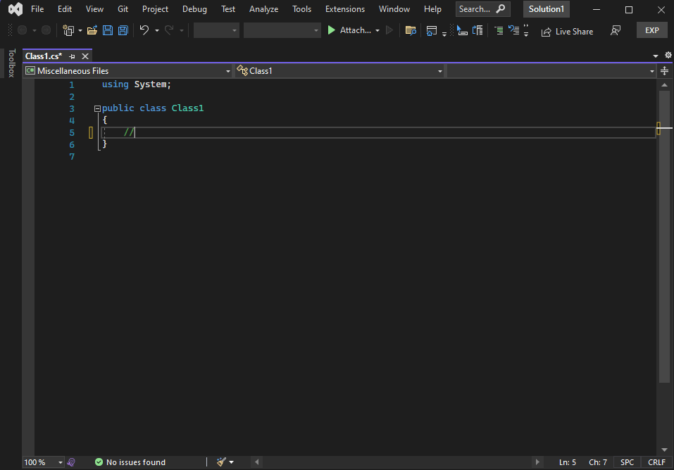
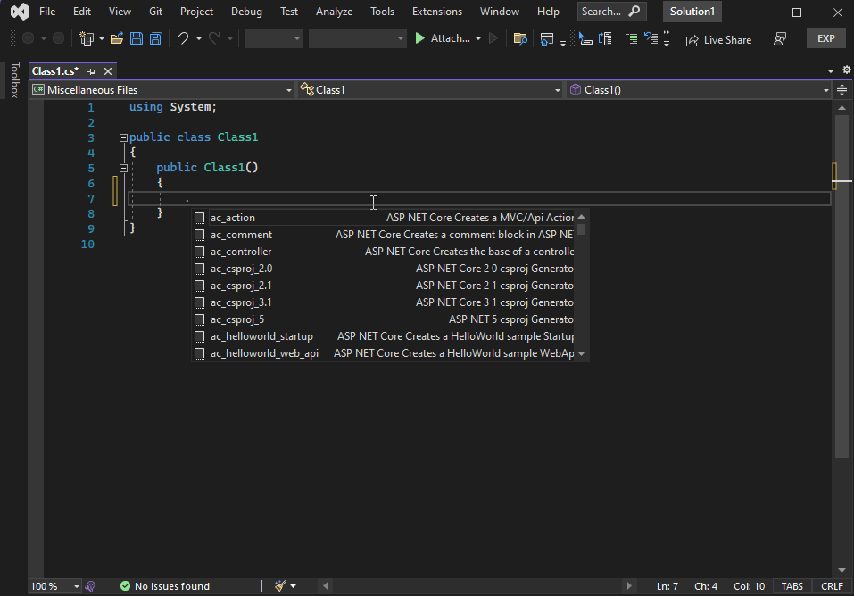
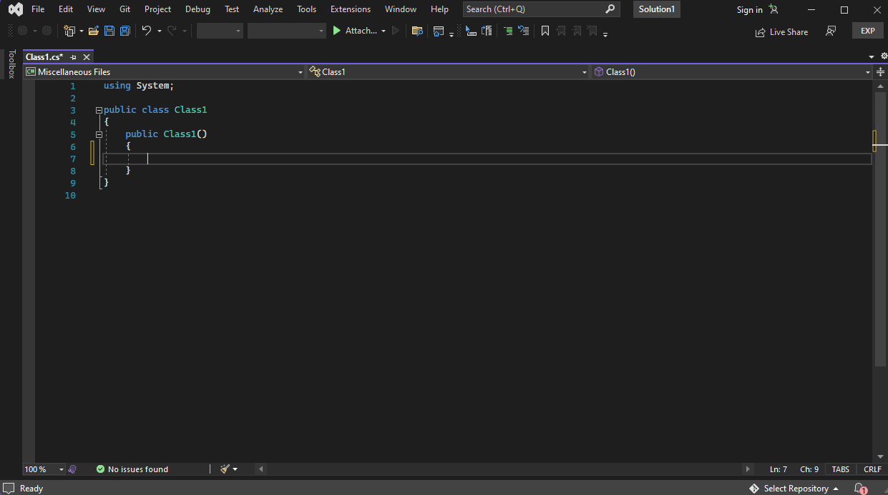
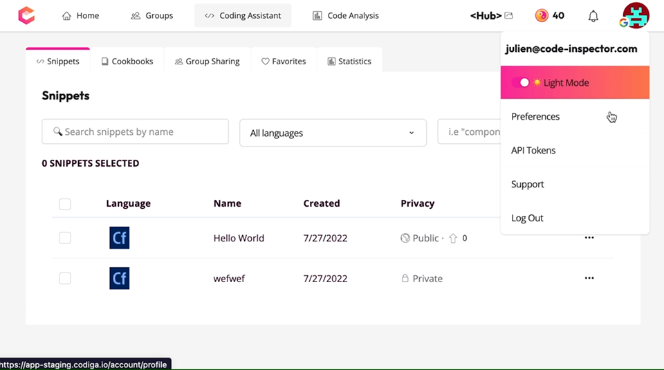
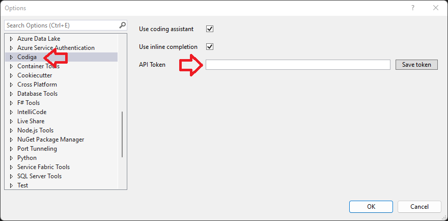

[Codiga](https://www.codiga.io) is a [Smart Code Snippets](https://www.codiga.io/code-snippets/smart-code-snippets/) manager. Create, share, search and use Smart Code Snippets from your IDE.

# Codiga: Code Snippets on Steroids

Look for snippets using a shortcut or search using inline completions like GitHub Copilot.

Adapt the list of snippets by adding your own.

## Quick Start

Start a comment and type what you want to have. Like GitHub Copilot, it suggests a list of snippets you can insert in your code.

## Use Snippets using Shortcuts

Install the extension and type `.` in Visual Studio to list all available smart code snippets for your project. Accept a smart code snippet using either Enter ↩ or Tab ↹. Go through the snippet variables using the Tab key.

## Find and Reuse Smart Code Snippets

Find snippets using an internal search engine using `CTRL` + `1` , `C` and search for a snippet.

## Supported Languages

C, C++, CSS, HTML, Java, Javascript, Typescript, Python, Dart, Ruby, PHP, Scala, Apex, Terraform, Docker, Go, Rust, Shell, Solidity, YAML.

## Getting API keys from Codiga

You need an API Token from [Codiga](https://codiga.io).
Log on [Codiga](https://app.codiga.io) using your GitHub, GitLab or Bitbucket account.

Then, in your preferences, generate a new API key as shown below.

Add the token in the Visual Studio settings (Tools/Options).

